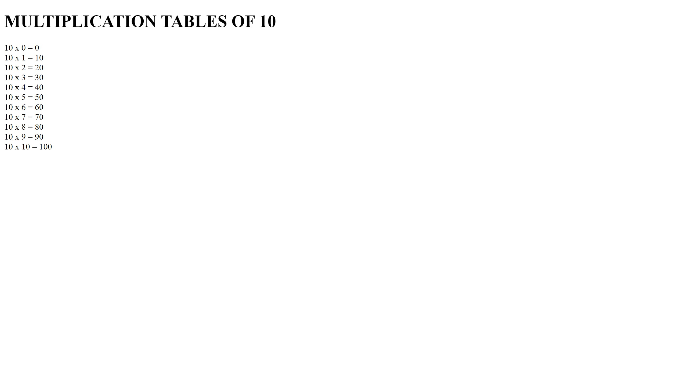
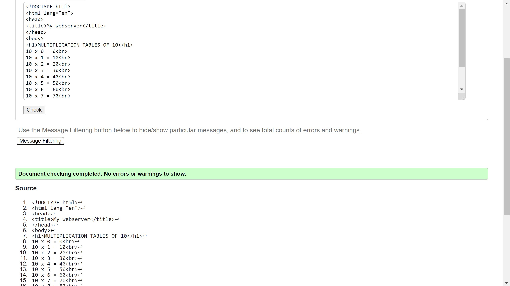

# Developing a Simple Webserver
## AIM:
To develop a simple webserver to serve html pages.

## DESIGN STEPS:
### Step 1: 
HTML content creation
### Step 2:
Design of webserver workflow
### Step 3:
Implementation using Python code
### Step 4:
Serving the HTML pages.
### Step 5:
Testing the webserver

## PROGRAM:
```
from http.server import HTTPServer, BaseHTTPRequestHandler
content = """
<!DOCTYPE html>
<html lang="en">
<head>
<title>My webserver</title>
</head>
<body>
<h1>MULTIPLICATION TABLES OF 10</h1>
10 x 0 = 0<br>
10 x 1 = 10<br>
10 x 2 = 20<br>
10 x 3 = 30<br>
10 x 4 = 40<br>
10 x 5 = 50<br>
10 x 6 = 60<br>
10 x 7 = 70<br>
10 x 8 = 80<br>
10 x 9 = 90<br>
10 x 10 = 100<br>
</body>
</html>
"""
class myhandler(BaseHTTPRequestHandler):
    def do_GET(self):
        print("request received")
        self.send_response(200)
        self.send_response(200)
        self.send_header('content-type', 'text/html; charset=utf-8')
        self.end_headers()
        self.wfile.write(content.encode()) 
server_address = ('', 80)
httpd = HTTPServer(server_address, myhandler)
print("my webserver is running...")
httpd.serve_forever()
```


## OUTPUT:


## CODE VALIDATION REPORT:


## RESULT:
Thus a website is designed for the simplewebserver and is hosted in the URL http://dhayanitha.student.saveetha.in/. HTML code is validated.